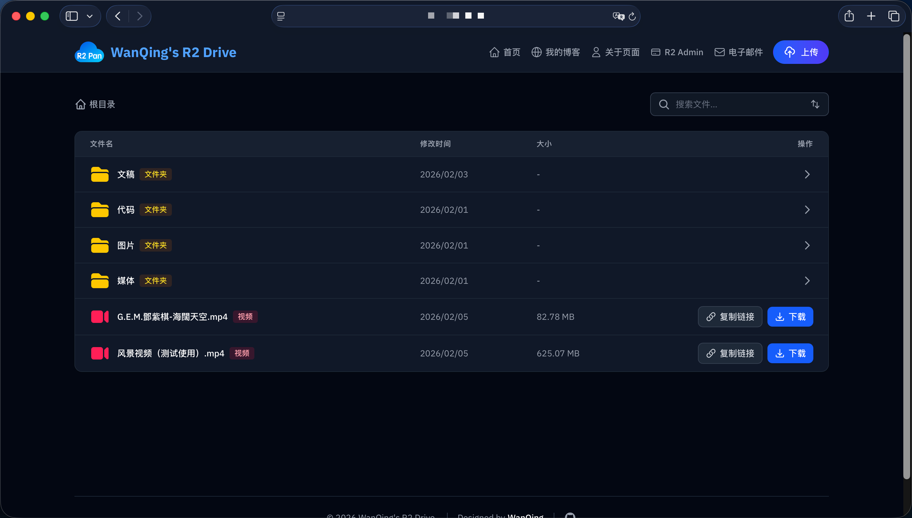

# Qing R2 Drive

一个基于 **Next.js 15** + **Cloudflare Pages** + **Cloudflare R2 对象存储** 的轻量云盘。

**Cloudflare R2 对象存储** 是一个非常强大的文件存储平台，免费用户可获取 10 GB 的存储空间，如果超出 10GB 的价格也是非常便宜，基本上可以满足大多数人的需求，最大的特点是**不限制出口流量**，在国内访问效果良好。

本打算使用 **Cloudflare R2 对象存储** 作为网站的图床使用，后来看见了 R2 index 项目，突发奇想，建一个自己喜欢的 UI 风格的个人网盘文件列表系统，供其他人预览和下载文件，至于对文件进行移动、重命名、批量下载等功能性操作，我也开发了另外一个专门对 **Cloudflare R2 对象存储 **桶内文件编辑的平台，如果大家感兴趣我会考虑开源。

- 站点：**任何人都可以访问**，查看 R2 存储桶内文件、预览、下载、复制分享链接；

- 上传：支持上传功能，并且支持大文件上传。

  

## ✨ 功能特性

- 📂 文件管理：文件夹层级浏览、面包屑导航

- 👀 在线预览：图片 / 音视频 / PDF / Office 文件（微软在线预览）

- ⬇️ 下载：任何人都可下载

- 🚀 上传：支持大文件上传，突破 **Cloudflare R2** 网页版最大上传 300 M 文件的限制

- 🔐 管理员登录：仅用于“上传”功能的身份认证

  

## 🛠️ 部署到 Cloudflare Pages

### 1) Fork 仓库并创建 Pages 项目

打开 Cloudflare 官方网站 → 计算和AI → Workers 和 Pages → 创建应用程序 → 选择创建 Pages → 连接 GitHub → 选择本项目。

### 2) 构建配置

- 框架预设：`Next.js`
- 构建命令：`npm run pages:build`
- 构建输出目录：`.vercel/output/static`
- 兼容性标志：添加 `nodejs_compat`（生产 / 预览）

### 3) 绑定 R2 存储桶（必须）

Workers 和 Pages → 选择本项目 → 设置 → 绑定 → 添加选择「R2 存储桶」。

- 变量名称：`BUCKET`
- 选择你的 R2 存储桶并保存

### 4) 环境变量（上传鉴权 / 建议）

Workers 和 Pages → 选择本项目 → 设置 → 变量和机密 → 添加：

| 变量名称 | 类型 | 说明 |
|:-:|:-:|:-:|
| `ADMIN_USERNAME` | 文本 | 管理员账号 |
| `ADMIN_PASSWORD` | 密钥 | 管理员密码 |
| `PUBLIC_R2_BASE_URL` | 文本 | R2 存储桶的自定义域或公共开发URL 启用后“下载”按钮会直连 R2 速度更快 必须要以 https:// 开头，不要以 / 结尾 |

变量「类型」 和「变量名称」可选择性添加上述表格内容，「值」处输入你的账号、密码、自定义域/公共开发URL。绑定好存储桶并且选择性配置变量后，重试部署等待2分钟左右配置成功即可成功。

> [!NOTE]
>
> 本项目通过 **R2 Binding** 直接访问桶，不需要 `R2_ACCESS_KEY_ID`/`R2_SECRET_ACCESS_KEY`/`Account ID`，也不需要给桶配置 CORS，极大减少了配置程序，小白配置友好。
